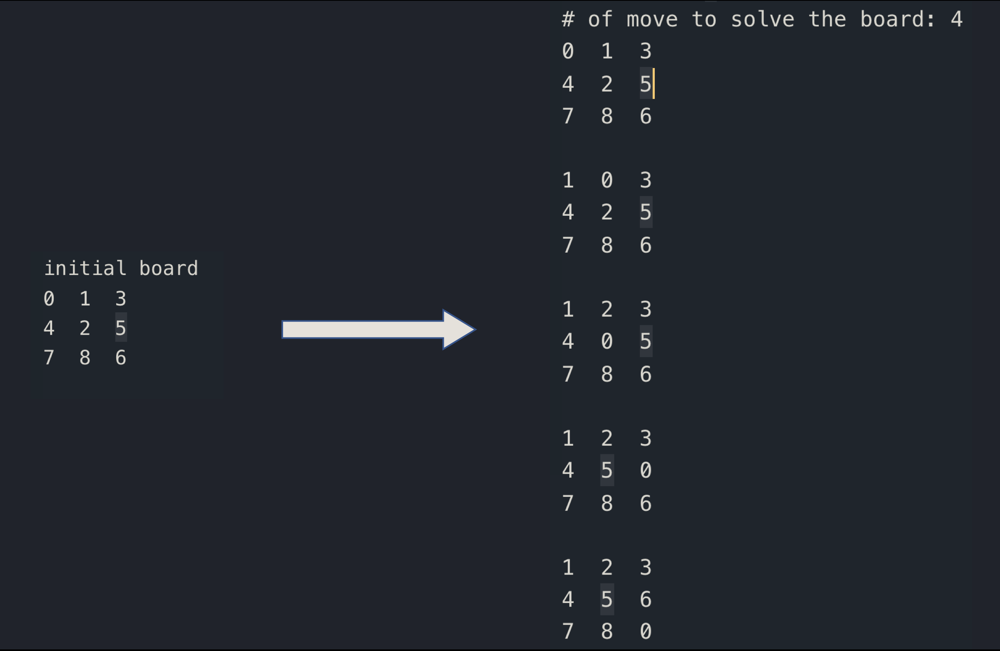

# Game Tree Solver: N-puzzle game (Artificial Inteligence)


> Code to solve the N-puzzle game (best known as the 8 puzzle game) using a min priority queue and the A* search algorithm.
> This problem is a classic problem in artificial intelligence

You can put any board you want to solve and the program will solve it (if it has solution) and show you the steps to follow to reach the solution:

Example:




## Getting Started 

The repository also contains the implementetions of a min and max priority queues with useful comments if you want to know how these algorithms work. The solver.py can work using either: the included minPQ.py or using the min priority queue from the python library ```heapq```. Read the comments inside the files for further information

You can create your own boards using either: the included random generator in the solver.py file

(a snippet of the code inside solver.py)
```python
// code away!
n = 3   # size of the board
a = list(random.sample(range(n*n),n*n))  
blocks = [[a[n*i+j] for j in range(n)] for i in range(n) ]
```
where n sets the size of the board. If you choose this option you only need change the value of n **or** you can create your own files in .txt and save them in the source_data folder. To solve those board you can use the following part of the code (also include in solver.py):

(a snippet of the code inside solver.py)
```python
data_folder = Path("source_data/")
file_to_open = data_folder / "puzzle05.txt"
f = open(file_to_open)
n = int(f.readline())
blocks = [[ int(el) for el in line.split()] for line in f ]
```
To know how to build your own boards in the right format, read the comments inside solver.py.
Uncomment any one of above lines of code depending in how you want to supply the boards

---

## Installation

- All the `code` and test cases required to get started are already included in this repo 


---

## FAQ

- will it be useful to look inside this code or it is of that kind of unreadable and ugly code?
    - Yes!!! It will be helpful to look inside, I try to write understandable code to make it accessible. 
      Inside there are useful comments explaining how the code works and it has some cool "plain text art" to illustrate
      some key concepts. If you want to learn how to do similar things (solve path finding or do optimization) you should 
      give it a try. 

---

## Support

Reach out to me at one of the following places!

- Coming soon...


---

## License

[](http://badges.mit-license.org)

- **[MIT license](http://opensource.org/licenses/mit-license.php)**
